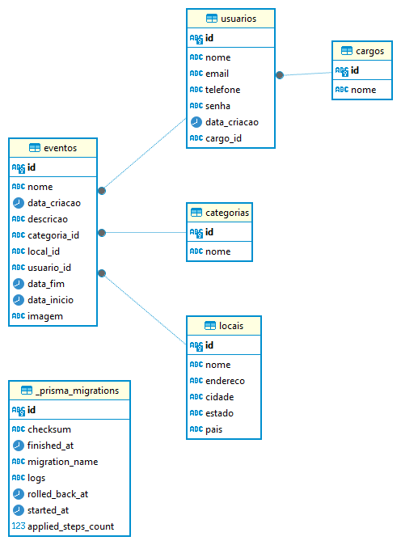

# Plataforma de Gerenciamento de Eventos Culturais

## ℹ️ Sobre

Este projeto consiste em uma **aplicação back-end (API) para Gerenciamento de Eventos Culturais**. A plataforma permite aos organizadores de eventos criar e listar eventos, e aos participantes explorar, pesquisar e filtrar eventos com base em categorias, locais e datas.

### 💻 Tecnologias e ferramentas utilizadas


## 📝 Pré-requesitos para testar a API localmente

Antes de utilizar o projeto, certifique-se de seguir as seguintes etapas:

- [x] **Ter o git instalado na máquina;**
- [x] **Ter o Node instalado;**
- [x] **Ter um banco de dados relacional instalado (De preferência o PostgreSQL)**;
- [x] **Ter um editor de código de sua preferência**;
- [x] **Clonar o repositório por meio do comando abaixo**:

  ```shell
  git clone https://github.com/Avanti-Bootcamp-GET-Geeks/back-end-plataforma-eventos-culturais.git
  ```

- [x] **Utilize uma ferramenta que possibilite realizar todos os tipos de requisições como o Postman, Insomnia etc.**

## ⚙️ Configurações necessárias

> Com o repositório clonado, execute os comandos abaixo (no diretório do projeto):

- **Para baixar as dependências**: `npm install`;
- **Crie um arquivo com o nome** `.env` e insira nele o código que está no arquivo `.env.example` e realize os ajustes necessários.

  1. **DATABASE_URL**: insira sua senha em '`senhaDoBanco`' e o nome o nome do banco de dados '`nomeDoBanco`' para o projeto em questão.
  1. **SECRET_JWT**: modifique a chave fornecida por outra de sua preferência.
  1. **ROLE_VISITANTE**: O sistema terá 3 tipos de usuários/cargos - 1. `admin`, 2. `organizador`, 3. `visitante`. **Após cadastro do visitante**, insira o `id` deste cargo na variável em questão.

>[!IMPORTANT]
> 
> Para a criação dos cargos acesse o arquivo `roleRoutes.js` e remova o middleware `authorization` do `método POST`;
>
> Como está: `roleRoutes.post('/role', authorization, validation.valitadeRoleData, roleController.createRole);`
>
> Como deve ficar: `roleRoutes.post('/role', validation.valitadeRoleData, roleController.createRole);`
>
> **Após criação de TODOS os cargos**, adicione o o middleware `authorization` novamente.
>
> ⚠️ **Atenção**: A cada alteração na rota faz-se necessária a reinicialização do projeto - `npm start` - para que o mesmo funcione corretamente (certifique-se de salvar o arquivo antes);
>
> 

- **Esquemas do banco de dados**: execute o comando `npx prisma migrate dev` após a criação do banco e a configuração do mesmo no arquivo **.env**;
- **Execute o programa utilizando o comando** `npm start`


## 🌐 Métodos aceitos

- **GET**: Para listagem de registro(s).
- **POST**: Para criação de novo(s) registro(s).
- **PUT**: Para atualização de registro(s) existente(s).
- **DELETE**: Para exclusão de registro(s).

## 🎲 Estruturas de dados

As estruturas de dados necessárias para o funcionamento do sistema foram definidas por meio do ORM Prisma para o banco de dados PostgreSQL. Abaixo está um resumo das entidades:

- **Categorias**: Representa as categorias dos eventos.
- **Locais**: Descreve os locais onde os eventos ocorrerão.
- **Eventos**: Contém informações sobre os eventos, incluindo nome, descrição, datas e relacionamentos com categorias e locais.
- **Cargos**: Define os cargos dos usuários.
- **Usuários**: Armazena dados dos usuários, incluindo nome, email, telefone, senha e cargo.

<div style="text-align: center;">
    <h4>ER Diagrama </h4>
    
</div>

## 🔗 Endpoints

### Categorias

- **GET `/categories`**: Retorna todas as categorias de eventos.
- **POST `/category`**: Cria uma nova categoria.

- **GET `/category/:id`**: Retorna uma categoria específica pelo ID.
- **PUT `/category/:id`**: Atualiza uma categoria existente pelo ID.
- **DELETE `/category/:id`**: Exclui uma categoria pelo ID.

### Eventos

- **GET `/events`**: Retorna todos os eventos.
- **GET `/events/user/:id`**: Retorna todos os eventos com base no usuário que o criou.
- **GET `/event/:id`**: Retorna um evento específico pelo ID.
- **POST `/event`**: Cria um novo evento.
- **PUT `/event/:id`**: Atualiza um evento existente pelo ID.
- **DELETE `/event/:id`**: Exclui um evento pelo ID.

### Locais

- **GET `/locals`**: Retorna todos os locais.
- **GET `/local/:id`**: Retorna um local específico pelo ID.
- **POST `/local`**: Cria um novo local.
- **PUT `/local/:id`**: Atualiza um local existente pelo ID.
- **DELETE `/local/:id`**: Exclui um local pelo ID.

### Cargos

- **GET `/roles`**: Retorna todos os cargos de usuário.
- **GET `/role/:id`**: Retorna um cargo específico pelo ID.
- **POST `/role`**: Cria um novo cargo.
- **PUT `/role/:id`**: Atualiza um cargo existente pelo ID.
- **DELETE `/role/:id`**: Exclui um cargo pelo ID.

### Usuários

- **GET `/users`**: Retorna todos os usuários.
- **GET `/user/:id`**: Retorna um usuário específico pelo ID.
- **POST `/user`**: Cria um novo usuário.
- **PUT `/user/:id`**: Atualiza um usuário existente pelo ID.
- **DELETE `/user/:id`**: Exclui um usuário pelo ID.

### Autenticação

- **POST `/login`**: Realiza o login de um usuário.

⚠️ Atenção:

1. Usuários com `cargo visitante` não podem realizar requisições aos métodos **POST**, **PUT** e **DELETE**, havendo uma exceção apenas nas rotas de `user`.
2. A autenticação é `obrigatória` para todos os tipos de usuários, sendo dispensável apenas para `leitura de dados`.

## 📖 Documentação Swagger

Após inicializar a aplicação (`npm start`), você pode utilizar a documentação **Swagger** para realizar testes por meio dos `endpoints` disponíveis, além de consultar todos os `schemas`. Para tanto, acesse o endpoint a seguir: `http://localhost:3000/api-docs`.

